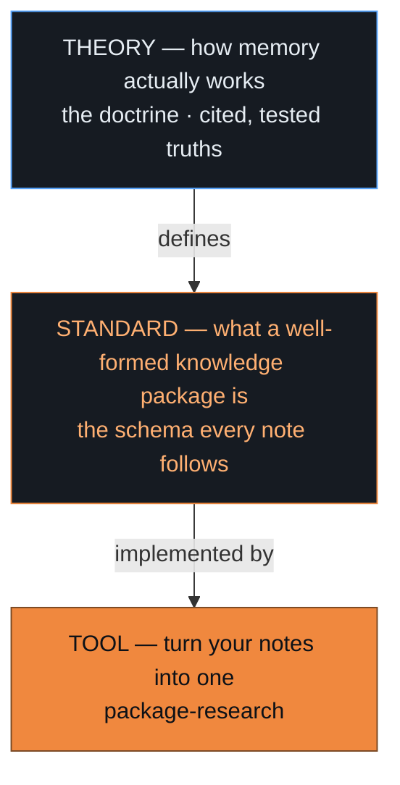

# The Memory Doctrine

**A theory of how memory works — turned into a standard for knowledge, turned into a tool that packages it. All open, so improving any layer improves them all.**

`open · CC BY 4.0`

https://github.com/user-attachments/assets/1c87f193-bd6a-401b-a4fd-00dcbcaeece1



That stack isn't aspirational — all three layers are in this repo:

- **The theory** → [`axioms/`](axioms) + [`clusters/`](clusters) — the cited truths, in seven themes.
- **The standard** → [`scripts/doctrine_lint.py`](scripts/doctrine_lint.py) — the mechanical checker every package must pass.
- **The tool** → [`tools/package-research`](tools/package-research) — turns your notes into a conformant package.
- **The open edges** → [`OPEN-QUESTIONS.md`](OPEN-QUESTIONS.md) — what the standard hasn't settled yet.

## The problem

Every AI agent has memory — a vector store, a RAG pipeline, a "memory" feature. But those are all just the *bottom* layer: a tool floating on nothing. The field has no shared, evidence-based answer to what memory *is* or what makes it good, so everyone rebuilds the same intuitions, benchmark by benchmark.

The Memory Doctrine is the **whole stack** — a real theory, the standard that follows from it, and a tool that runs on both. Each layer earns the next: because the theory is sound, the standard is principled; because the standard is concrete, the tool is real.

---

## 1 · The theory — how memory actually works

Distilled from research across psychology, neuroscience, information theory, and AI into a short set of **cited, confidence-weighted truths** about memory. You don't need to read every note — here's the core in five ideas:

1. **It's a network, and the connections are the point.** What a fact *means* is what it's connected to — value lives in the links, not the nodes.
2. **Remembering is reconstruction, not lookup.** You rebuild a memory from a cue. (The math for it is the same math as "attention" inside AI models — an embedding store *is* a kind of memory.)
3. **"Sure," "true," and "easy to recall" are three different things.** Confidence must be *earned by evidence*, not from how familiar something feels. Confuse them and you get *confident-but-wrong* — the root of both human false memory and AI hallucination.
4. **You forget the path, not the memory — and surprise is the trigger to learn.** What tells memory to write something *new* is surprise: the gap between expected and actual.
5. **To keep knowledge, keep only the ideas that generate the rest.** Find the few load-bearing truths, cite them, and build from there.

The theory is organized into **seven themes**, each answering one question about memory:

| Theme | The question it answers | The headline idea |
|---|---|---|
| **[Structure](clusters/A-structure.md)** | How is knowledge shaped? | The value is in the connections, not the facts |
| **[Retrieval](clusters/B-retrieval.md)** | How is it recalled? | Remembering is reconstruction — the same math as AI attention |
| **[Truth](clusters/C-truth.md)** | How sure, and how do we know? | Confidence must be earned by evidence, kept apart from familiarity |
| **[Dynamics](clusters/D-dynamics.md)** | How does it change over time? | You lose the path, not the belief; surprise drives new learning |
| **[Method](clusters/E-method.md)** | How do you build and check it? | Keep the load-bearing ideas; verify them adversarially |
| **[Meta](clusters/F-meta.md)** | What does it know about itself? | Where the deepest unifications live |
| **[Prospective](clusters/G-prospective.md)** | How does an agent remember to *act*? | Tie reminders to things you'll naturally pass by |

Each idea is its own short, cited note — [browse them all](axioms). Every claim traces to primary research and was put through adversarial review before it was accepted.

---

## 2 · The standard — what a well-formed knowledge package is

The theory doesn't just describe memory; it tells you **what a good unit of knowledge should look like.** A *knowledge package* built to the doctrine is:

- a **thin index** of ideas, each one **confidence-weighted** (the score earned from evidence),
- pointing to a **rich store** of the cited sources behind them,
- with **typed links** between ideas, and the **rules for revising them** shipped alongside.

That's the standard — and it's mechanically checkable: a small linter enforces it, and the package installs and validates with `kpm doctor`. The doctrine **is its own reference implementation** of the standard: this repo is a knowledge package that obeys every rule it states.

---

## 3 · The tool — turn your knowledge into a package

`package-research` is the standard, made runnable — and it lives in this repo, at [`tools/package-research`](tools/package-research). Point it at a folder of notes, research, or transcripts and it runs the doctrine's pipeline — distilling the load-bearing ideas, scoring their confidence from the evidence, splitting index from store, and verifying each — to produce a clean, cited package that passes the standard.


```bash
# from a clone of this repo:
cd tools/package-research && pip install -e .
package-research run ./my-notes --out ./my-kpm
```

It runs two ways: with an API key it does the distilling itself; or in **keyless "skill mode"** an AI agent drives it — the agent does the judgment, the tool guarantees the structure. Either way the output passes the same gates. → [how it works](tools/package-research)

"Summarize my notes" becomes "distill my notes into cited, confidence-weighted, reusable knowledge."

---

## Open by design — improve one, improve all

The three layers are tied together *and* open (CC BY 4.0), so a win anywhere propagates:

- **Challenge an axiom** → the theory sharpens → the standard it defines sharpens → the tool produces better packages.
- **Improve the tool** → it stress-tests the standard → which feeds back into the theory.

Most memory systems are a closed bottom layer. This is an open stack that **gets better as a whole** — every adopter who challenges a claim or improves the tool improves the foundation for everyone.

## Challenge it

This doctrine is **made to be argued with.** Open an issue titled `challenge: <idea>` with a real citation, and a well-supported objection will lower an idea's confidence, narrow it, or retire it. See **[CONTRIBUTING.md](CONTRIBUTING.md)** — and **[OPEN-QUESTIONS.md](OPEN-QUESTIONS.md)** for the gaps the standard hasn't settled yet. The fastest way to improve the whole stack is to try to break the theory it rests on.

*Licensed [CC BY 4.0](LICENSE) — adapt and improve freely, with attribution.*
